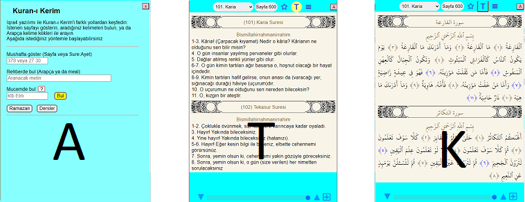

## Design specs

### Goal

We want the verses to be accessible from various search/presentation methods

* Kuran/start  Giriş paneli
* Kuran/mujam  Mucem
* Rehber/finder  Rehber
* Rehber/simi  Benzerlik
* Kitap/ders  Kelimelerin gücü
* Kitap/rama  Ramazan 1442
* ...

### Panels

A: Access 
T: Translation
K: Quran

 
Wide screen needs no transition

 
Tablet mode is tricky

 
Horizotal swipe and pink buttons

### User interface

* Keyboard
* Mouse
* Touch
* Button/Menu
